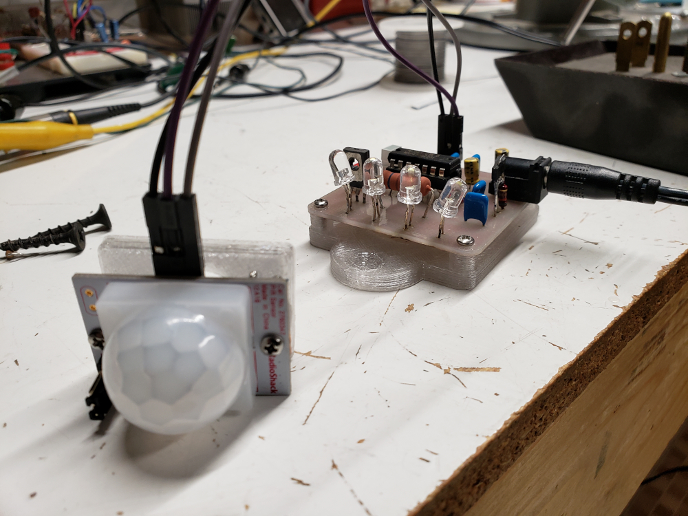

# Stair_light

MSP430G2231 based led controller, reads a PIR sensor via an interrupt then activates 4 leds and a timer that runs for approximately 30 seconds.

It can be powered via a 5v to 12v supply, just be sure to use the appropriately rated current limiting resistor.

